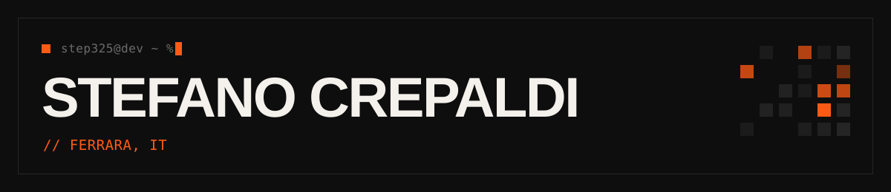

<picture>
  <source media="(prefers-color-scheme: dark)" srcset="assets/banner-dark.svg">
  <source media="(prefers-color-scheme: light)" srcset="assets/banner-light.svg">
  
</picture>

<a href="README.md">EN</a> · **IT**

Studente universitario a Ferrara. Scrivo software, di solito perché prima serviva a me.

Il ripasso serale sulle flashcard. Dettare il codice invece di digitarlo. I turni di sbobinatura.  
Ogni volta la stessa storia: lo facevo a mano, finché non ho scritto qualcosa che lo facesse al posto mio.  
Poi è saltato fuori che il problema ce l'avevano anche altri.

LLM che girano su GPU consumer. Mamba 2, BitNet 1.58b, MoE. [Elleci](https://stefanocrepaldi.dev/progetti/elleci) è dove lo verifico.  
Rust e Tauri, per le app desktop che uso ogni giorno.  
[remquest](https://github.com/step325/remquest), tra una sessione di ripasso e l'altra.

**[remquest](https://github.com/step325/remquest)** il mio ripasso RemNote come RPG 16 bit. Le carte da ripassare diventano il boss, 26 mostri, XP  
**VoxCode** dettatura vocale per il coding. Tieni premuto, parli, il testo arriva pulito nell'editor. Rust, Tauri

**[Foristo](https://www.foristo.it)** gestionale per pizzerie. Chiusura cassa, ore dei dipendenti, presenze, avvisi quando cambiano le normative  
**[Calendario Sbobine](https://stefanocrepaldi.dev/progetti/calendariosbobine)** 500 studenti, turni di sbobinatura assegnati in automatico  
**[Recall Manager](https://stefanocrepaldi.dev/progetti/recall-manager)** 5.000 contatti fuori da un foglio Excel, dentro un CRM  
**[Smart Booking](https://stefanocrepaldi.dev/progetti/smart-booking)** un vocale su WhatsApp diventa una prenotazione

[stefanocrepaldi.dev](https://stefanocrepaldi.dev) · [LinkedIn](https://www.linkedin.com/in/stefano-crepaldi-646560364/) · [stefano@stefanocrepaldi.dev](mailto:stefano@stefanocrepaldi.dev)
